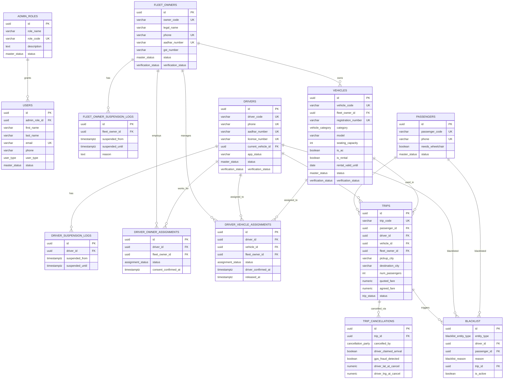

# Turrant Master Data ERD v2

```mermaid
erDiagram
    ADMIN_ROLES {
        uuid id PK
        varchar role_name
        varchar role_code UK
        text description
        master_status status
    }

    USERS {
        uuid id PK
        uuid admin_role_id FK
        varchar first_name
        varchar last_name
        varchar email UK
        varchar phone
        user_type user_type
        master_status status
    }

    FLEET_OWNERS {
        uuid id PK
        varchar owner_code UK
        varchar legal_name
        varchar phone UK
        varchar aadhar_number UK
        varchar gst_number
        master_status status
        verification_status verification_status
    }

    FLEET_OWNER_SUSPENSION_LOGS {
        uuid id PK
        uuid fleet_owner_id FK
        timestamptz suspended_from
        timestamptz suspended_until
        text reason
    }

    VEHICLES {
        uuid id PK
        varchar vehicle_code UK
        uuid fleet_owner_id FK
        varchar registration_number UK
        vehicle_category category
        varchar model
        int seating_capacity
        boolean is_ac
        boolean is_rental
        date rental_valid_until
        master_status status
        verification_status verification_status
    }

    DRIVERS {
        uuid id PK
        varchar driver_code UK
        varchar phone UK
        varchar aadhar_number UK
        varchar license_number UK
        uuid current_vehicle_id FK
        varchar app_status
        master_status status
        verification_status verification_status
    }

    DRIVER_SUSPENSION_LOGS {
        uuid id PK
        uuid driver_id FK
        timestamptz suspended_from
        timestamptz suspended_until
    }

    DRIVER_OWNER_ASSIGNMENTS {
        uuid id PK
        uuid driver_id FK
        uuid fleet_owner_id FK
        assignment_status status
        timestamptz consent_confirmed_at
    }

    DRIVER_VEHICLE_ASSIGNMENTS {
        uuid id PK
        uuid driver_id FK
        uuid vehicle_id FK
        uuid fleet_owner_id FK
        assignment_status status
        timestamptz driver_confirmed_at
        timestamptz released_at
    }

    PASSENGERS {
        uuid id PK
        varchar passenger_code UK
        varchar phone UK
        boolean needs_wheelchair
        master_status status
    }

    TRIPS {
        uuid id PK
        varchar trip_code UK
        uuid passenger_id FK
        uuid driver_id FK
        uuid vehicle_id FK
        uuid fleet_owner_id FK
        varchar pickup_city
        varchar destination_city
        int num_passengers
        numeric quoted_fare
        numeric agreed_fare
        trip_status status
    }

    TRIP_CANCELLATIONS {
        uuid id PK
        uuid trip_id FK
        cancellation_party cancelled_by
        boolean driver_claimed_arrival
        boolean gps_fraud_detected
        numeric driver_lat_at_cancel
        numeric driver_lng_at_cancel
    }

    BLACKLIST {
        uuid id PK
        blacklist_entity_type entity_type
        uuid driver_id FK
        uuid passenger_id FK
        blacklist_reason reason
        uuid trip_id FK
        boolean is_active
    }

    ADMIN_ROLES ||--o{ USERS : grants
    FLEET_OWNERS ||--o{ FLEET_OWNER_SUSPENSION_LOGS : has
    FLEET_OWNERS ||--o{ VEHICLES : owns
    FLEET_OWNERS ||--o{ DRIVER_OWNER_ASSIGNMENTS : employs
    FLEET_OWNERS ||--o{ DRIVER_VEHICLE_ASSIGNMENTS : manages
    DRIVERS ||--o{ DRIVER_SUSPENSION_LOGS : has
    DRIVERS ||--o{ DRIVER_OWNER_ASSIGNMENTS : works_for
    DRIVERS ||--o{ DRIVER_VEHICLE_ASSIGNMENTS : assigned_to
    VEHICLES ||--o{ DRIVER_VEHICLE_ASSIGNMENTS : assigned_to
    PASSENGERS ||--o{ TRIPS : books
    DRIVERS ||--o{ TRIPS : drives
    VEHICLES ||--o{ TRIPS : used_in
    TRIPS ||--o{ TRIP_CANCELLATIONS : cancelled_via
    TRIPS ||--o{ BLACKLIST : triggers
    DRIVERS ||--o{ BLACKLIST : blacklisted
    PASSENGERS ||--o{ BLACKLIST : blacklisted
```
